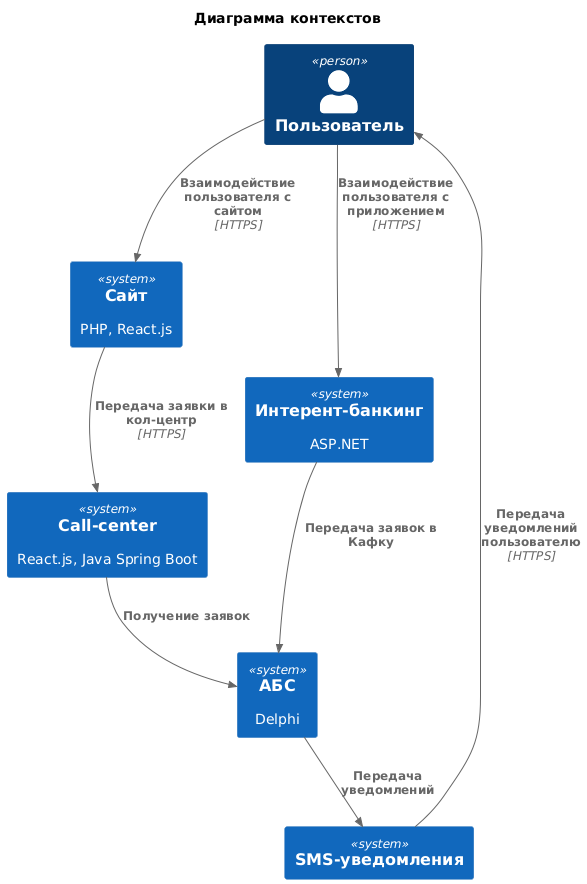
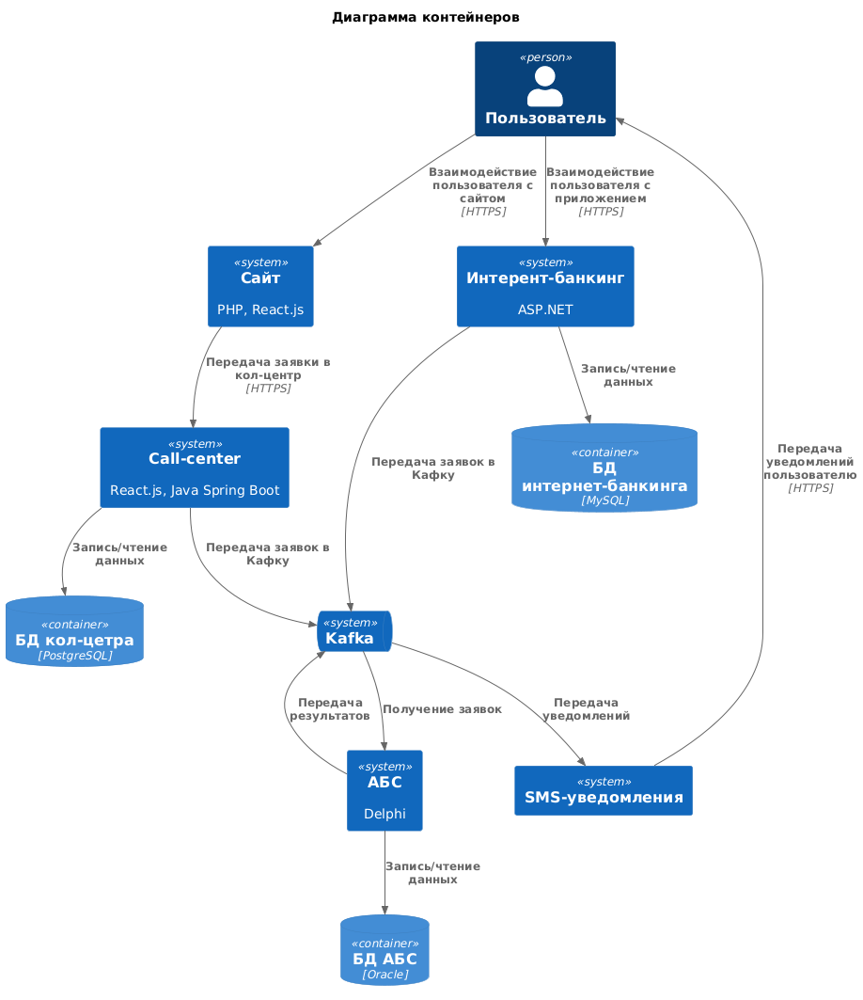

### **Название задачи:** Открытие депозитов онлайн

### **Автор:** Разработчик

### **Дата:** 26.05.2025

### **Функциональные требования**

| №   | Действующие лица или системы | Use Case                         | Описание                                                                                                           |
| --- | ---------------------------- | -------------------------------- | ------------------------------------------------------------------------------------------------------------------ |
| 1   | Клиент (интернет-банк)       | Выбор депозитного продукта       | Клиент выбирает депозитный продукт из списка доступных в интернет-банке. Подтверждает через СМС.                   |
| 2   | Клиент (сайт)                | Выбор депозитного продукта       | Выбирает продукт на сайте, оформляет заявку, подтверждает через звонок из кол-центра.                              |
| 3   | Интернет-банк/сайт           | Отправка заявки в АБС            | Заявка на депозит передаётся из интернет-банка или кол-центра в АБС для дальнейшей обработки.                      |
| 4   | Кол-центр                    | Подтверждение заявки             | После создания заявки клиенту звонит оператор кол-центра.                                                          |
| 5   | Система СМС-уведомлений      | Отправка СМС-уведомления клиенту | Подтверждение заявки. После подтверждения размера ставки и открытия депозита клиенту отправляется СМС-уведомление. |
| 6   | Менеджер бэк-офиса (АБС)     | Обработка заявки на депозит      | Менеджер бэк-офиса подтверждает условия депозита в АБС.                                                            |
| 7   | АБС                          | Обработка заявок                 | Расчеты условий, обработка заявок.                                                                                 |

### **Нефункциональные требования**

| №   | Требование                                                                |
| --- | ------------------------------------------------------------------------- |
| 1   | Надёжность работы систем при обработке заявок на депозиты                 |
| 2   | Реализация механизма шифрования данных при передаче между системами       |
| 3   | Быстрый отклик по всем операциям                                          |
| 4   | Оптимизация работы с базами данных для снижения нагрузки на АБС           |
| 5   | Горизонтальное масштабирование систем для обеспечения высокой доступности |

### **Решение**

### **Альтернативы**

- разбить АБС на микросервисы с отдельными БД
- единый gateway

**Недостатки, ограничения, риски**

- монолитиный АБС
- обработка заявок менеджерами
- вертикальное масштабирование
