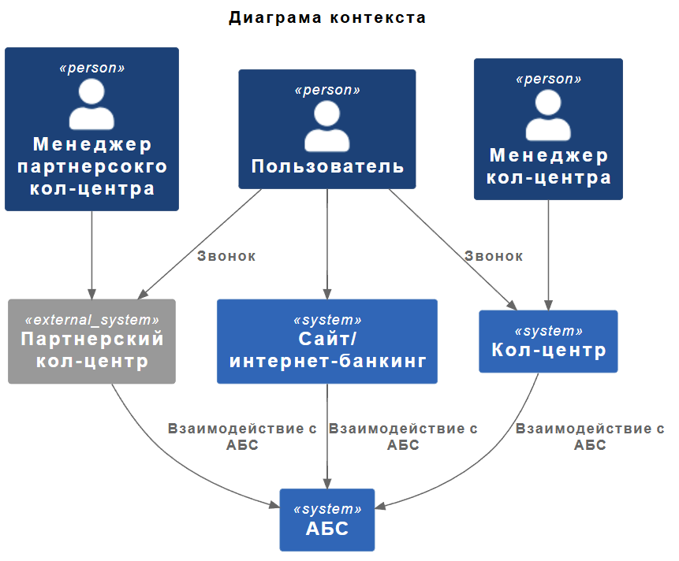
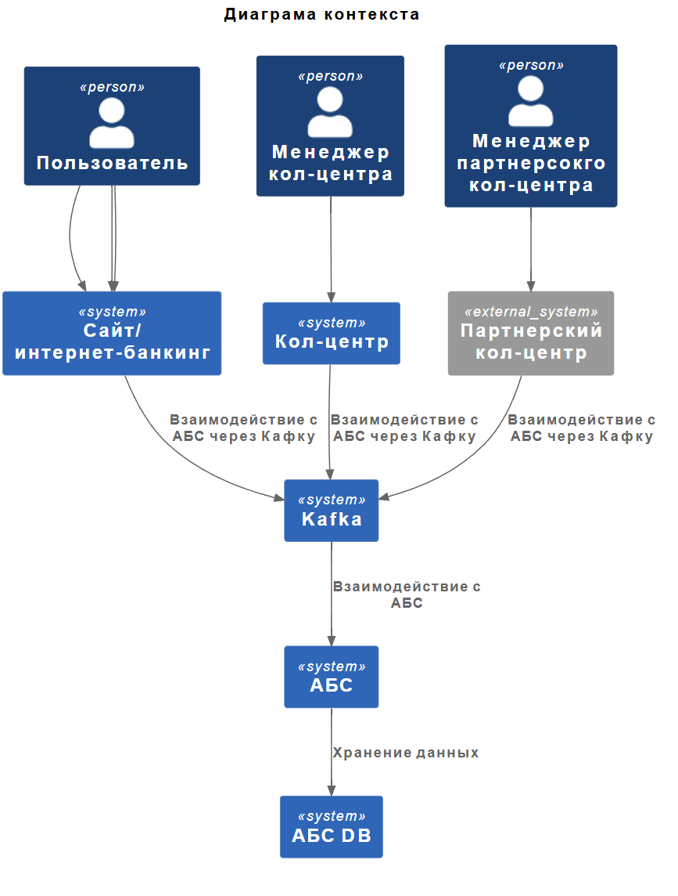

### **Название задачи:** Передача ставок в кол-центр

### **Автор:** Разработчик

### **Дата:** 26.05.2025

### **Функциональные требования**

| №   | Действующие лица или системы | Use Case                                     | Описание                                                                                               |
| --- | ---------------------------- | -------------------------------------------- | ------------------------------------------------------------------------------------------------------ |
| 1   | Система кол-центра           | Получение актуальных ставок по депозитам     | Система кол-центра получает доступ к актуальным ставкам по депозитам для консультации клиентов.        |
| 2   | Партнёрский кол-центр        | Получение актуальных ставок по депозитам     | Партнёрский кол-центр получает актуальные ставки по депозитам в виде файлов для консультации клиентов. |
| 3   | АБС                          | Предоставление данных о ставках по депозитам | АБС предоставляет данные о ставках по депозитам системе кол-центра и партнёрскому кол-центру.          |

### **Нефункциональные требования**

| №   | Требование                                                                                         |
| --- | -------------------------------------------------------------------------------------------------- |
| 1   | Обеспечение безопасности передачи данных о ставках по депозитам между АБС и системами кол-центров. |
| 2   | Обеспечение доступности данных о ставках по депозитам для систем кол-центров 24/7.                 |
| 3   | Минимизация времени обновления данных о ставках по депозитам в системах кол-центров.               |

### **Решение**

### **Альтернативы**

- Передавать ставки не в виде файлов и тогда рассмотреть возможность сделать АПИ АБС для кол-центров

**Недостатки, ограничения, риски**

- Необходимость доработки функционала обмена данными в АБС и системах кол-центров.
- Риск задержки обновления данных о ставках в системах кол-центров из-за ограничений в механизме обмена данными.
- Ограниченная возможность настройки доступа к данным о ставках для разных групп пользователей в системах кол-центров.
